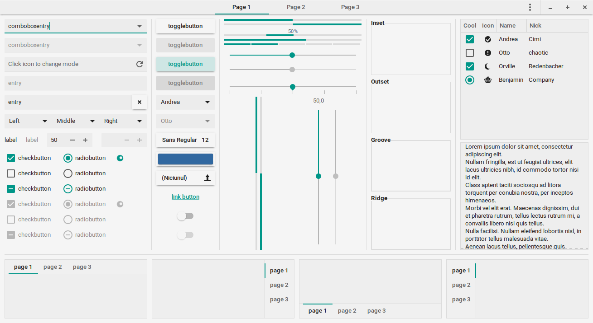

# Papier GTK themes - the freshest themes for your desktop.
Have an idea for a colour combination? PR it or suggest it in the issues!

Screenshots:

AndroidLight: It screams Google.

AndroidDark: Already have pre-A12 nostalgia?

StockMaterial: When someone forgets to change their Android app's colour.

LighterTeal: An airy theme.

LightTeal: Mixed toolbars.

DimTeal: Low-contrast.

Oceanic: The classic developer theme, now for your desktop.

DarkerTeal: Welcome to the dark side.

DarkerOrange: Welcome to the dark side.

Palenight: But too saturated. Use it if you can.

Minty: Linux Mint Materia.

DarkMinty: Linux Mint's dark side.

Humanish: 2000s Ubuntu mixed with Materia.

DarkHumanish: How 2000s Ubuntu would have looked now.

DawkHumanishNeutral: Is brown not your thing?

More to come.

